노년기 희망거주상태를 결정하는 변수 분석
================

초록
----

### 분석주제 소개 및 요약

현재 우리나라는 노인 고독사와 같은 노년층의 거주문제, 빈곤문제들이 자주 언론에서 거론되고 있다. 공교롭게도 노인 자살률은 OECD 회원국 중 1위이다. 모든 노인들, 또는 노년기를 앞두고 있는 사람들 중에서는 자신의 노년기를 외롭게 혼자 보내고 싶어하는 사람들은 없다. 하지만 자신의 주변 환경 여건에 따라 앞으로의 상황은 바뀌기 마련이다. 따라서 노년기 희망 거주상태에 영향을 미치는 변수들을 알아보고자 한다.

노년기 희망거주상태(이하 희망거주상태)를 알아보기 위해 희망거주상태에 영향을 미칠 것 같은 변수들을 세 가지 정도로 추려보았다. 첫 번째로 가구세대구성, 두 번째는 주관적인 사회경제적 지위(이하 경제적 지위), 마지막으로 가족생활만족도가 바로 그것이다.

첫 번째로 **가구세대구성**에 따라서 희망거주상태가 어떻게 달라지는지 분석하였다. (응답자 중에서 5세대 이상의 세대구성은 없었다.) 그리고 각 1, 2, 3, 4세대별 어떤 거주형태를 원하는지 나누어 세대별 원그래프를 그려 시각화 하였다.

두 번째는 **경제적 지위**에 따른 희망거주상태를 알아보았다. 경제적 지위 변수는 상상, 상하, 중상, 중하와 같이 나누어져 있었는데, 분석의 편의성을 위해 상, 중, 하로 통합하여 재분류하였다. 또한 두 번째 분석은 첫 번째와 마찬가지로 각각의 경제적 지위별로 원하는 거주형태를 나누었고, 원그래프로 이를 나타내었다.

마지막은 **가족생활만족도**에 따른 희망거주상태 분석이다. 가족생활만족도는 총 6개의 변수로 이루어져있었는데, 그중 하나는 미해당(미혼 등)에 해당하는 것이어서 이는 결측 처리하고 분석하였다. 마지막도 앞 분석과 마찬가지로 만족도 별로 원하는 거주형태를 나누었고, 막대그래프로 시각화하여 표현하였다.

결론적으로 세 가지 변수에 따른 분석에서 모두 '마음맞는', '부부만' 이 두가지 항목이 세 가지 분석과 그 각각의 분석 모두에서 1, 2위를 차지했다. 또한 ‘자녀와동거’ 항목은 항상 ‘자녀가까이’ 뒤에 머무는 4위, 5위 패턴을 보였다. 위 두가지 공통적인 패턴이 모든 각각의 항목에서 나타났다.(4세대 분석에서만 예외적으로 ‘부부만’, ‘자녀와동거’ 항목만 있는 형태를 띠었다.)

데이터 소개
-----------

분석에 쓰인 자료는 서울연구데이터서비스에서 다운로드 할 수 있는 서울복지실태조사 데이터이다. 컴퓨터를 활용한 가구방문면접조사를 통해 조사되어졌다. 서울시민의 생활실태와 복지 욕구 변화 추적을 위한 데이터 구축과 서울시 복지 정책 수립 및 집행성과 모니터링을 위한 근거 자료 수집을 위한 데이터이다. 가구 구성원의 정보, 가구 유형, 거주지, 부채정도, 생활비 수준, 복지서비스 이용관련 항목 등.. 복지실태조사를 위한 다양한 항목들로 이루어진 데이터자료이다. <http://data.si.re.kr/sisurvey2015er17>

분석
----

``` r
### 패키지 장착
library(readxl)
```

    ## Warning: package 'readxl' was built under R version 3.4.4

``` r
library(dplyr)
```

    ## 
    ## Attaching package: 'dplyr'

    ## The following objects are masked from 'package:stats':
    ## 
    ##     filter, lag

    ## The following objects are masked from 'package:base':
    ## 
    ##     intersect, setdiff, setequal, union

``` r
library(ggplot2)
```

    ## Warning: package 'ggplot2' was built under R version 3.4.4

``` r
df <- read_excel("서울복지실태조사.xlsx")
```

    ## Warning in read_fun(path = path, sheet = sheet, limits = limits, shim =
    ## shim, : Expecting logical in UM1007 / R1007C559: got '媛쒖씤援먯궗'

    ## Warning in read_fun(path = path, sheet = sheet, limits = limits, shim =
    ## shim, : Expecting logical in AES2190 / R2190C825: got '�쒓낏�꾩썝�앺솢'

    ## Warning in read_fun(path = path, sheet = sheet, limits = limits, shim =
    ## shim, : Expecting logical in PG2194 / R2194C423: got '1�멸�援�'

    ## Warning in read_fun(path = path, sheet = sheet, limits = limits, shim =
    ## shim, : Expecting logical in AES2247 / R2247C825: got '�쒓낏�꾩썝�앺솢'

    ## Warning in read_fun(path = path, sheet = sheet, limits = limits, shim =
    ## shim, : Expecting logical in AES2257 / R2257C825: got '�쒓낏�꾩썝�앺솢'

``` r
### 데이터 준비
df <- rename(df, rank=B14, family=fam_t, after=F16, life=D1)

df <- df %>% select(rank,family,after,life) 
df
```

    ## # A tibble: 3,019 x 4
    ##     rank family after  life
    ##    <dbl>  <dbl> <dbl> <dbl>
    ##  1    4.     2.    2.    4.
    ##  2    3.     2.    4.    4.
    ##  3    4.     2.    1.    4.
    ##  4    3.     2.    1.    3.
    ##  5    4.     2.    4.    3.
    ##  6    4.     1.    1.    3.
    ##  7    4.     2.    2.    3.
    ##  8    5.     2.    4.    2.
    ##  9    4.     2.    1.    3.
    ## 10    4.     2.    1.    3.
    ## # ... with 3,009 more rows

``` r
### 변수 검토
table(df$rank)
```

    ## 
    ##    1    2    3    4    5    6 
    ##    3   19  471 1342  877  307

1~6으로 이루어진 코드로, 모두 정상범위이다.

``` r
table(df$family)
```

    ## 
    ##    1    2    3    4 
    ## 1443 1501   71    4

1~6으로 이루어진 코드인데, 1~4까지로 모두 정상범위이다.

``` r
table(df$after)
```

    ## 
    ##   1   2   3   4   5   6  99 
    ## 992 413  77 909 622   3   3

``` r
table(df$life)
```

    ## 
    ##    0    1    2    3    4    5 
    ##  797   15  167  945 1053   42

after는 99에 해당하는 이상치가 있고, life에는 비해당에 속하는 이상치가 있다.

``` r
### 전처리 & 항목 이름부여

### 경제적지위 변수추가 ###

df <- df %>% 
  mutate(where=ifelse(rank==1 | rank==2,"top",ifelse(rank==3|rank==4,"middle","bottom")))
```

    ## Warning: package 'bindrcpp' was built under R version 3.4.4

``` r
### 희망거주상태 변수추가 ###

df <- df %>% mutate(khome=ifelse(after==1,"부부만",
                                 ifelse(after==2,"자녀가까이",
                                        ifelse(after==3,"자녀와동거",
                                               ifelse(after==4,"마음맞는",
                                                      ifelse(after==5,"실버타운",
                                                             ifelse(after==6,"시골전원생활",NA)))))))
table(df$khome)
```

    ## 
    ##     마음맞는       부부만 시골전원생활     실버타운   자녀가까이 
    ##          909          992            3          622          413 
    ##   자녀와동거 
    ##           77

``` r
###가족생활만족도 변수추가 ###

df <- df %>% mutate(happy=ifelse(life==1,"매우불만족",
                                 ifelse(life==2,"대체로불만족",
                                        ifelse(life==3,"보통",
                                               ifelse(life==4,"대체로만족",
                                                      ifelse(life==5,"매우만족",NA))))))
table(df$happy)
```

    ## 
    ##   대체로만족 대체로불만족     매우만족   매우불만족         보통 
    ##         1053          167           42           15          945

가족세대구성원은 숫자가 그대로 1세대,2세대를 가리켜서 그대로 놔두었다.

### 분석-(1) 가구세대구성 - 노년기 희망거주상태

``` r
### 가구세대구성에 따른 노년기 희망거주상태

khome_family <- df %>% 
  filter(!is.na(khome)) %>% 
  group_by(family,khome) %>% 
  summarise(n=n())
khome_family
```

    ## # A tibble: 18 x 3
    ## # Groups:   family [?]
    ##    family khome            n
    ##     <dbl> <chr>        <int>
    ##  1     1. 마음맞는       480
    ##  2     1. 부부만         444
    ##  3     1. 실버타운       325
    ##  4     1. 자녀가까이     162
    ##  5     1. 자녀와동거      29
    ##  6     2. 마음맞는       407
    ##  7     2. 부부만         523
    ##  8     2. 시골전원생활     3
    ##  9     2. 실버타운       289
    ## 10     2. 자녀가까이     238
    ## 11     2. 자녀와동거      41
    ## 12     3. 마음맞는        22
    ## 13     3. 부부만          23
    ## 14     3. 실버타운         8
    ## 15     3. 자녀가까이      13
    ## 16     3. 자녀와동거       5
    ## 17     4. 부부만           2
    ## 18     4. 자녀와동거       2

``` r
### 1세대-노년기 희망거주상태 원그래프 ###

b <- c(480,444,325,162,29)
a <- c("마음맞는","부부만","실버타운","자녀가까이","자녀와동거")
c <- round(b/sum(b)*100,1)
a <- paste(a,c)
a <- paste(a,"%",sep = "")
pie(b,labels = a,col=rainbow(length(a)),main = "1세대-노년기 희망거주상태")
```

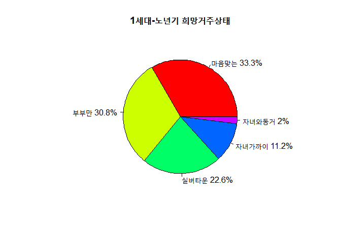

``` r
### 2세대-노년기 희망거주상태 원그래프 ###

d <- c(523,407,289,238,41,3)
e <- c("부부만","마음맞는","실버타운","자녀가까이","자녀와동거","시골전원생활")
f <- round(d/sum(d)*100,1)
e <- paste(e,f)
e <- paste(e,"%",sep = "")
pie(d,labels = e,col = rainbow(length(e)),main = "2세대-노년기 희망거주상태")
```

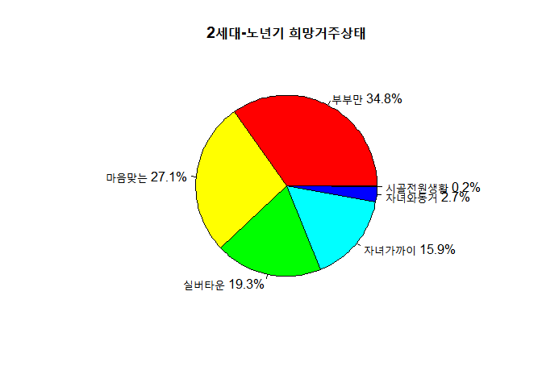

``` r
### 3세대-노년기 희망거주상태 원그래프 ###

g <- c(23,22,13,8,5)
h <- c("부부만","마음맞는","자녀가까이","실버타운","자녀와동거")
i <- round(g/sum(g)*100,1)
h <- paste(h,i)
h <- paste(h,"%",sep = "")
pie(g,labels = h,col = rainbow(length(h)),main = "3세대-노년기 희망거주상태")
```

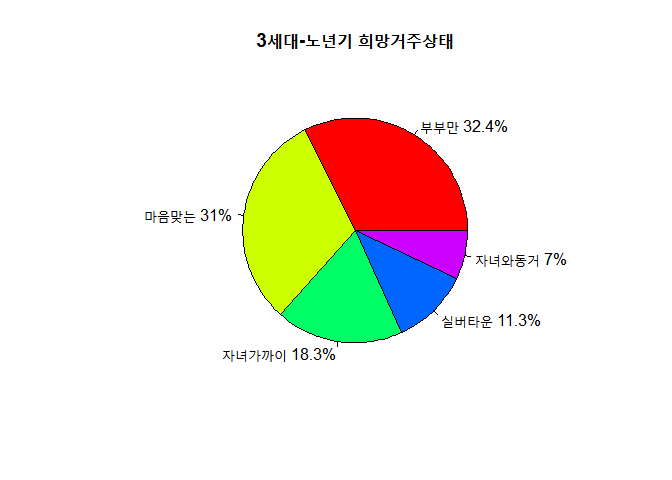

``` r
### 4세대-노년기 희망거주상태 원그래프 ###

j <- c(2,2)
k <- c("부부만","자녀와동거")
l <- round(j/sum(j)*100,1)
k <- paste(k,l)
k <- paste(k,"%",sep = "")
pie(j,labels = k,col = rainbow(length(k)),main = "4세대-노년기 희망거주상태")
```

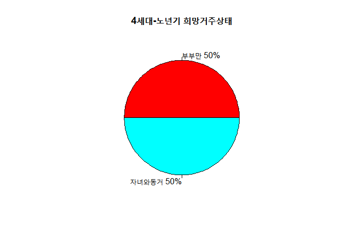

### 분석-(2) 주관적인 사회경제적위치 - 노년기희망거주상태

``` r
### 주관적인 사회경제적지위에 따른 노년기 희망거주상태

khome_where <- df %>% 
  filter(!is.na(khome)) %>% 
  group_by(where,khome) %>% 
  summarise(n=n()) %>% 
  arrange(desc(where))
khome_where
```

    ## # A tibble: 16 x 3
    ## # Groups:   where [3]
    ##    where  khome            n
    ##    <chr>  <chr>        <int>
    ##  1 top    마음맞는         8
    ##  2 top    부부만           9
    ##  3 top    실버타운         4
    ##  4 top    자녀가까이       1
    ##  5 middle 마음맞는       500
    ##  6 middle 부부만         655
    ##  7 middle 시골전원생활     2
    ##  8 middle 실버타운       373
    ##  9 middle 자녀가까이     243
    ## 10 middle 자녀와동거      40
    ## 11 bottom 마음맞는       401
    ## 12 bottom 부부만         328
    ## 13 bottom 시골전원생활     1
    ## 14 bottom 실버타운       245
    ## 15 bottom 자녀가까이     169
    ## 16 bottom 자녀와동거      37

``` r
### 상위층- 노년기 희망거주상태 원그래프 ###

m <- c(9,8,4,1)
n <- c("부부만","마음맞는","실버타운","자녀가까이")
o <- round(m/sum(m)*100)
n <- paste(n,o)
n <- paste(n,"%",sep = "")
pie(m,labels = n,col = rainbow(length(n)),main = "상위층- 노년기 희망거주상태")
```

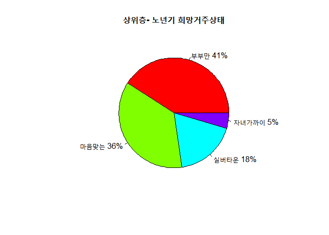

``` r
### 중위층- 노년기 희망거주상태 원그래프 ###

p <- c(655,500,373,243,40,2)
q <- c("부부만","마음맞는","실버타운","자녀가까이","자녀와동거","시골전원생활")
r <- round(p/sum(p)*100,1)
q <- paste(q,r)
q <- paste(q,"%",sep = "")
pie(p,labels = q,col = rainbow(length(q)),main="중위층- 노년기 희망거주상태")
```

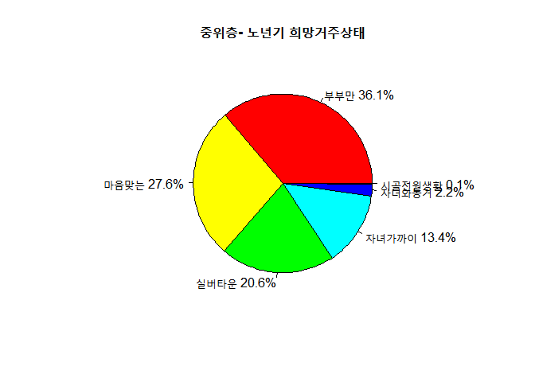

``` r
### 하위층- 노년기 희망거주상태 원그래프 ###

s <- c(401,328,245,169,37,1)
t <- c("마음맞는","부부만","실버타운","자녀가까이","자녀와동거","시골전원생활")
u <- round(s/sum(s)*100,1)
t <- paste(t,u)
t <- paste(t,"%",sep = "")
pie(s,labels = t,col = rainbow(length(t)),main = "하위층- 노년기 희망거주상태")
```

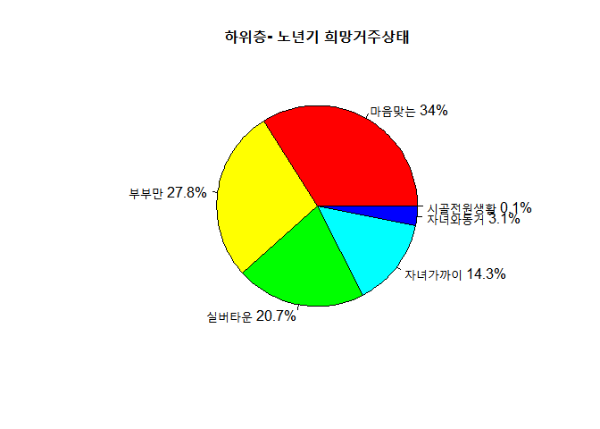

### 분석-(3) 가족생활만족도 - 노년기희망거주상태

``` r
### 가족생활만족도에 따른 노년기 희망거주상태

khome_happy <- df %>% 
  filter(!is.na(happy)& !is.na(khome)) %>%
  group_by(happy,khome) %>% 
  summarise(n=n()) %>% 
  arrange(happy)
khome_happy
```

    ## # A tibble: 27 x 3
    ## # Groups:   happy [5]
    ##    happy        khome            n
    ##    <chr>        <chr>        <int>
    ##  1 대체로만족   마음맞는       299
    ##  2 대체로만족   부부만         405
    ##  3 대체로만족   시골전원생활     2
    ##  4 대체로만족   실버타운       183
    ##  5 대체로만족   자녀가까이     141
    ##  6 대체로만족   자녀와동거      23
    ##  7 대체로불만족 마음맞는        59
    ##  8 대체로불만족 부부만          51
    ##  9 대체로불만족 실버타운        34
    ## 10 대체로불만족 자녀가까이      19
    ## # ... with 17 more rows

``` r
### 매우불만족-희망거주상태 ###
khome_happy1 <- khome_happy %>% 
  filter(!is.na(happy)& !is.na(khome)) %>% 
  filter(happy=="매우불만족") %>% 
  select(happy,khome,n)
khome_happy1
```

    ## # A tibble: 5 x 3
    ## # Groups:   happy [1]
    ##   happy      khome          n
    ##   <chr>      <chr>      <int>
    ## 1 매우불만족 마음맞는       5
    ## 2 매우불만족 부부만         4
    ## 3 매우불만족 실버타운       3
    ## 4 매우불만족 자녀가까이     2
    ## 5 매우불만족 자녀와동거     1

``` r
### 대체로불만족-희망거주상태 ###
khome_happy2 <- khome_happy %>% 
  filter(!is.na(happy)& !is.na(khome)) %>% 
  filter(happy=="대체로불만족") %>% 
  select(happy,khome,n) %>% 
  arrange(desc(n))
khome_happy2
```

    ## # A tibble: 5 x 3
    ## # Groups:   happy [1]
    ##   happy        khome          n
    ##   <chr>        <chr>      <int>
    ## 1 대체로불만족 마음맞는      59
    ## 2 대체로불만족 부부만        51
    ## 3 대체로불만족 실버타운      34
    ## 4 대체로불만족 자녀가까이    19
    ## 5 대체로불만족 자녀와동거     4

``` r
### 보통-희망거주상태 ###
khome_happy3 <- khome_happy %>% 
  filter(!is.na(happy)& !is.na(khome)) %>% 
  filter(happy=="보통") %>% 
  select(happy,khome,n) %>% 
  arrange(desc(n))
khome_happy3
```

    ## # A tibble: 5 x 3
    ## # Groups:   happy [1]
    ##   happy khome          n
    ##   <chr> <chr>      <int>
    ## 1 보통  부부만       346
    ## 2 보통  마음맞는     231
    ## 3 보통  실버타운     182
    ## 4 보통  자녀가까이   156
    ## 5 보통  자녀와동거    30

``` r
### 대체로만족-희망거주상태 ###
khome_happy4 <- khome_happy %>% 
  filter(!is.na(happy)& !is.na(khome)) %>% 
  filter(happy=="대체로만족") %>% 
  select(happy,khome,n) %>% 
  arrange(desc(n))
khome_happy4
```

    ## # A tibble: 6 x 3
    ## # Groups:   happy [1]
    ##   happy      khome            n
    ##   <chr>      <chr>        <int>
    ## 1 대체로만족 부부만         405
    ## 2 대체로만족 마음맞는       299
    ## 3 대체로만족 실버타운       183
    ## 4 대체로만족 자녀가까이     141
    ## 5 대체로만족 자녀와동거      23
    ## 6 대체로만족 시골전원생활     2

``` r
### 매우만족-희망거주상태 ###
khome_happy5 <- khome_happy %>% 
  filter(!is.na(happy)& !is.na(khome)) %>% 
  filter(happy=="매우만족") %>% 
  select(happy,khome,n) %>% 
  arrange(desc(n))
khome_happy5
```

    ## # A tibble: 6 x 3
    ## # Groups:   happy [1]
    ##   happy    khome            n
    ##   <chr>    <chr>        <int>
    ## 1 매우만족 마음맞는        15
    ## 2 매우만족 부부만          14
    ## 3 매우만족 실버타운         9
    ## 4 매우만족 자녀가까이       2
    ## 5 매우만족 시골전원생활     1
    ## 6 매우만족 자녀와동거       1

``` r
### 매우불만족 막대그래프 ###
ggplot(data=khome_happy1,aes(x=khome, y=n))+geom_col()
```

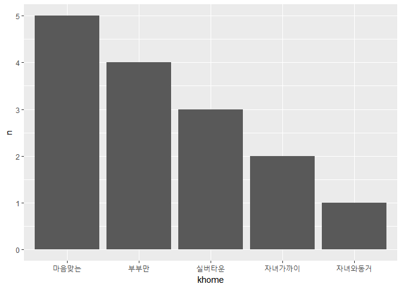

``` r
### 대체로불만족 막대그래프 ###
ggplot(data=khome_happy2,aes(x=khome, y=n))+geom_col()
```

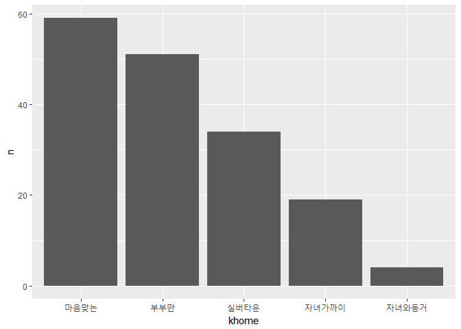

``` r
### 보통 막대그래프 ###
ggplot(data=khome_happy3,aes(x=khome, y=n))+geom_col()
```

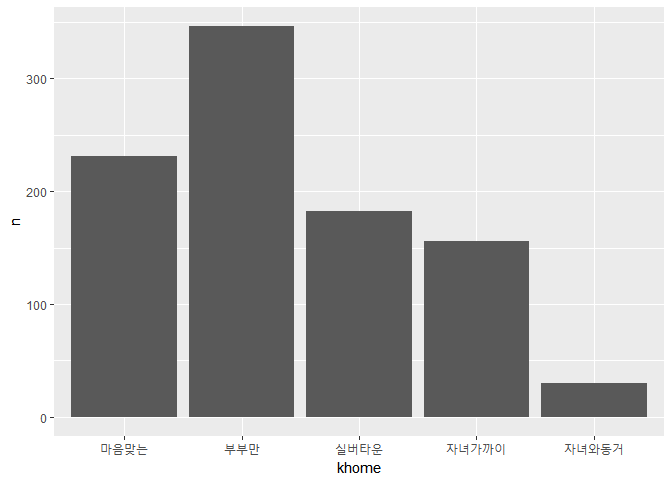

``` r
### 대체로만족 막대그래프 ###
ggplot(data=khome_happy4,aes(x=khome, y=n))+geom_col()
```

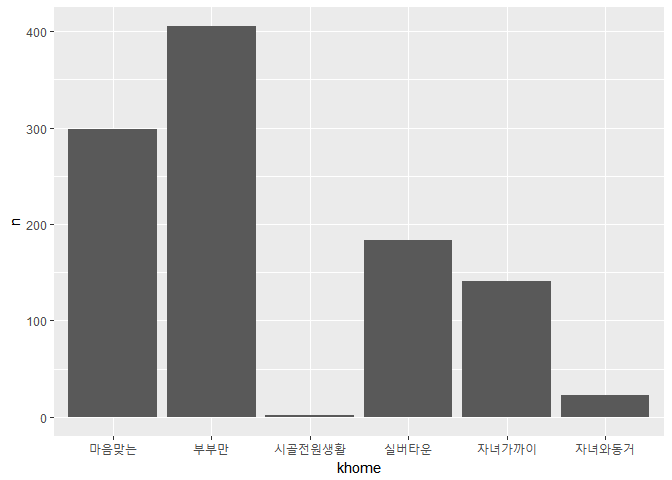

``` r
### 매우만족 막대그래프 ###
ggplot(data=khome_happy5,aes(x=khome, y=n))+geom_col()
```

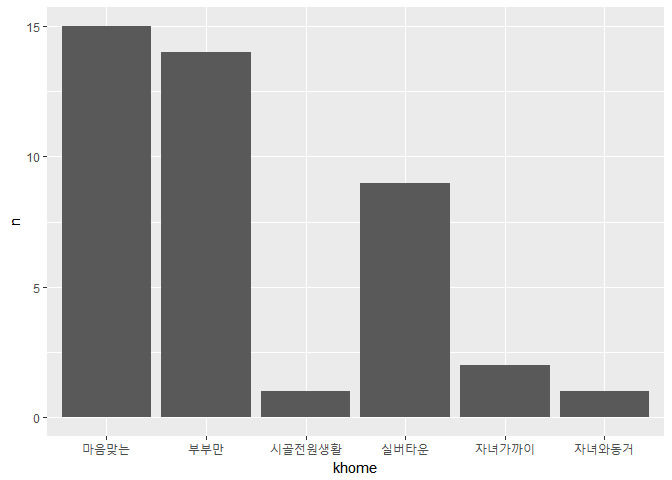

노년기 희망거주상태는 경제적지위, 가구세대구성, 가족생활만족도 모든 부분과 각각의 항목에서 (가구세대구성의 4세대 제외) ‘마음맞는’, ‘부부만’ 항목이 1,2위를 다툰다. 마음맞는 사람들끼리 지내고 싶다는 것은 미래에 배우자가 사별 했을 경우를 고려한 선택으로 미루어 짐작된다.

또 노인이 된 부모가 자녀에게 폐 끼치고 싶지 않다는 마음이 반영되었는지 ‘자녀와 동거’는 항상 ‘자녀가까이’ 뒤 순위에 물러나 있다. 가족생활만족도가 매우만족인 경우와 3세대 세대구성에서도 마찬가지였다. 실버타운도 대체로 15% 안팎을 밑돌았다. 눈여겨볼 점은 자녀와 가까이 살거나 동거하는 것보다 실버타운이 모든 항목에서 우위에 있다는 것이다. 하지만 4세대의 경우에는 아주 명확하게 부부만 살든지, 자녀와 동거하든지 라는 극과 극인 선택으로 나누어졌다.

논의
----

세 가지라는 적지않은 변수들을 이용해 노년기 희망거주상태를 분석했다. 하지만 좀더 다양한 부분에서의 분석결과를 위해 성별, 나이대별 등... 다양한 변수들을 이용해 추가분석을 한다면 더욱더 구체적인 분석지가 될 것이다. 또한 세 가지 모두 원그래프를 이용하면 단조로울까봐 막대그래프를 이용했는데, 막대그래프보다 원그래프가 더 구체적으로 보여주는 것 같아 마음이 놓이지 않는다. 하지만 막대그래프 위에 만족도별로 개수를 나타낸 표가 있기에 그것을 참고하길 바란다.
